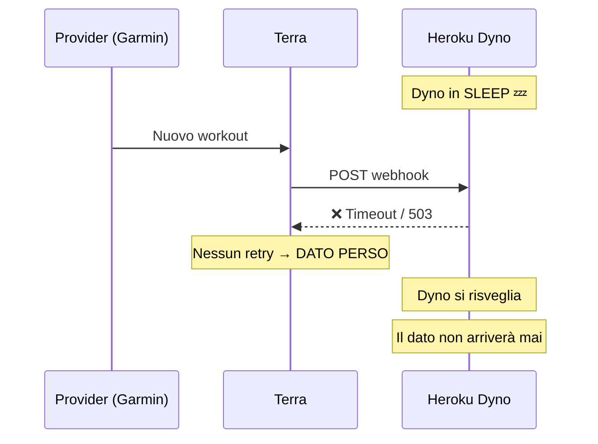
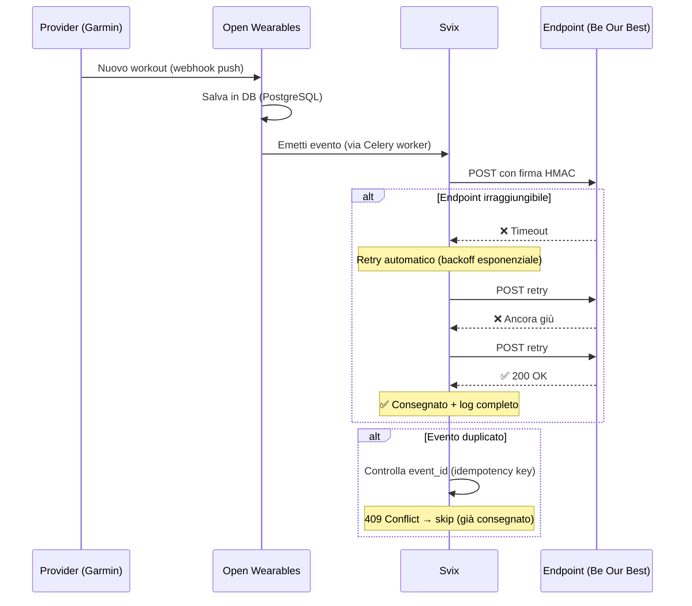
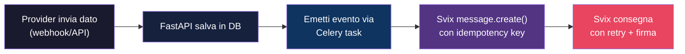
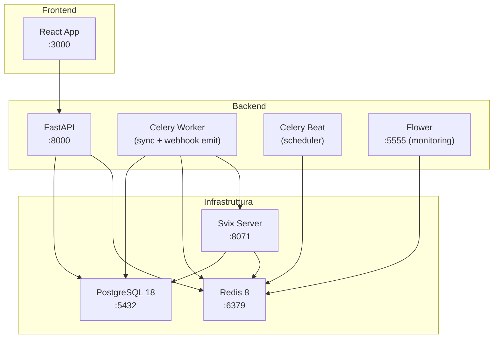

# POC Open Wearables — Consegna Affidabile dei Dati Wearable

> **Cliente**: Be Our Best  
> **Istanza live**: `api.ow.beourbest.eu`  
> **Data**: 25 maggio 2026  
> **Stato**: ✅ POC locale completato — pronto per Fase 1 (test reale)

---

## 1. Contesto e Problema

### Situazione attuale (Terra)

L'integrazione attuale con **Terra** utilizza un modello push "fire-and-forget" per la consegna dei dati wearable. Questo modello presenta tre punti deboli critici:

| Problema | Impatto |
|----------|---------|
| **Nessun retry robusto** | Se l'endpoint è irraggiungibile, il dato viene perso silenziosamente |
| **Nessuna de-duplicazione** | Rischio di dati duplicati senza meccanismo di idempotenza |
| **Nessuna verifica firma** | Nessuna garanzia che il payload ricevuto sia autentico |

### Ipotesi root cause (da confermare)

Il ricevitore dell'app Be Our Best gira su un **dyno Heroku** che va in **sleep dopo 30 min di inattività** o in **timeout** sotto carico. Le push di Terra che arrivano durante queste finestre falliscono e — senza retry con backoff esponenziale e idempotenza robusta — **spariscono in silenzio**.



Questa ipotesi è coerente con il sintomo osservato: **perdita intermittente di dati**, specialmente in orari di bassa attività.

---

## 2. Soluzione Proposta: Open Wearables + Svix

Open Wearables utilizza **Svix** come layer di consegna webhook, un servizio infrastrutturale enterprise-grade che garantisce:



### I tre meccanismi chiave

| # | Meccanismo | Terra | Open Wearables + Svix |
|---|-----------|-------|----------------------|
| 1 | **Firma crittografica** | ❌ Assente o debole | ✅ HMAC-SHA256 per endpoint, verifica a ogni richiesta |
| 2 | **Idempotenza / de-duplica** | ❌ Assente | ✅ `event_id` univoco per evento → Svix restituisce 409 se già consegnato |
| 3 | **Retry con backoff** | ❌ Fire-and-forget | ✅ Retry automatico con backoff esponenziale, log di ogni tentativo |
| — | **Storico consegne** | ❌ Nessuno | ✅ Dashboard con storico completo: messaggi, tentativi, status code, tempi di risposta |

---

## 3. Risultati del POC (Prove Dirette)

### Ambiente di test

- Open Wearables in locale (Docker Compose: 8 container)
- Dati sintetici (seed + generati via API)
- Endpoint di ricezione con banco di misura dedicato

### Prova 1 — Firma Verificata ✅

| Scenario | Risultato |
|----------|-----------|
| Payload con firma Svix valida | ✅ **200 OK** — accettato |
| Payload con firma invalida / assente | ❌ **400 Bad Request** — rifiutato |

**Significato**: nessun attore esterno può iniettare payload falsi. Ogni endpoint riceve un **signing secret** univoco recuperabile via API:

```
GET /api/v1/developer/webhooks/endpoints/{endpoint_id}/secret
→ { "key": "whsec_..." }
```

### Prova 2 — Idempotenza / De-duplica ✅

| Scenario | Risultato |
|----------|-----------|
| 30 invii dello stesso evento (stesso `event_id`) | **1 sola consegna** all'endpoint |

**Significato**: anche in caso di retry multipli o replay accidentali, l'endpoint riceve ogni evento **esattamente una volta**.

> [!NOTE]
> **Evidenza nel codice sorgente**: ogni evento emesso da Open Wearables include un `idempotency_key` deterministico:
> - Workout: `workout.created.{record_id}`
> - Sleep: `sleep.created.{record_id}`
> - Timeseries: `timeseries.{user_id}.{provider}.{series_type}.{start_time}.{end_time}`
> - Sync: `sync.started.{run_id}` / `sync.completed.{run_id}` / `sync.failed.{run_id}`
> 
> Svix restituisce HTTP 409 se la stessa chiave è già stata consegnata, e il sistema lo gestisce come successo (nessun retry inutile).

### Prova 3 — Retry → Zero Perdite ✅

| Scenario | Risultato |
|----------|-----------|
| Endpoint irraggiungibile al primo tentativo | Svix ritenta in automatico |
| Endpoint torna online | ✅ Evento consegnato con successo |

**Osservazione dal vivo**: sequenza `fail` → `success` sullo **stesso messaggio**, con log completo di ogni tentativo (timestamp, status code, tempo di risposta).

**Significato**: il dato **non si perde mai**. Anche se l'endpoint è giù per ore, Svix continuerà a ritentare con backoff esponenziale.

---

## 4. Dettaglio Tecnico — Come Funziona nel Codice

### Pipeline di consegna (5 step)



#### Step 1–2: Ingestione e persistenza
Il provider (Garmin, Whoop, etc.) invia i dati. Open Wearables li salva in PostgreSQL **prima** di emettere qualsiasi webhook. Il dato è al sicuro indipendentemente dalla consegna.

#### Step 3: Celery task asincrono
L'emissione del webhook avviene in un **Celery worker** separato, mai nel thread della richiesta HTTP. Configurazione:

```python
@shared_task(
    bind=True,
    max_retries=2,          # Retry lato Celery (se Svix è irraggiungibile)
    default_retry_delay=5,  # 5 secondi tra retry Celery
    acks_late=True,         # ACK solo dopo successo
)
```

> [!IMPORTANT]
> Ci sono **due livelli di retry** indipendenti:
> 1. **Celery** (max 2 retry) — se Svix stesso è irraggiungibile
> 2. **Svix** (backoff esponenziale per ore/giorni) — se l'endpoint destinazione è irraggiungibile
>
> Questo garantisce che il dato non si perde nemmeno in caso di failure infrastrutturale.

#### Step 4: Svix message con idempotency
La chiave `event_id` passata a Svix è deterministica e costruita dal tipo di evento + ID del record. Svix gestisce la de-duplicazione nativamente.

#### Step 5: Consegna firmata con retry
Svix firma ogni payload con HMAC-SHA256 e consegna con retry automatico. Il consumer verifica la firma prima di accettare.

### Tipi di evento supportati

Open Wearables emette **95+ tipi di evento** organizzati in una gerarchia a due livelli:

| Livello | Esempio | Uso |
|---------|---------|-----|
| **Gruppo** | `heart_rate.created` | Tutti i campioni HR (resting, active, recovery, walking avg, AFib) |
| **Granulare** | `series.resting_heart_rate.created` | Solo resting heart rate |

**Eventi principali rilevanti per Be Our Best**:

| Evento | Descrizione |
|--------|-------------|
| `workout.created` | Nuova sessione workout salvata |
| `sleep.created` | Nuova sessione sonno salvata |
| `heart_rate.created` | Campioni frequenza cardiaca |
| `steps.created` | Campioni passi |
| `calories.created` | Campioni calorie |
| `spo2.created` | Campioni saturazione ossigeno |
| `body_composition.created` | Peso, BMI, massa grassa |
| `sync.started` / `sync.completed` / `sync.failed` | Lifecycle della sincronizzazione |
| `connection.created` | Nuovo provider collegato dall'utente |

> [!TIP]
> I campioni timeseries vengono inviati **inline** nel payload dell'evento (fino a 2.500 campioni per messaggio, ~500 KB). Batch più grandi vengono automaticamente suddivisi in chunk con `chunk_index` / `total_chunks` per il riassemblaggio.

### API di gestione webhook

L'istanza live offre una REST API completa per la gestione degli endpoint:

| Endpoint | Metodo | Funzione |
|----------|--------|----------|
| `/api/v1/developer/webhooks/endpoints` | `POST` | Crea endpoint |
| `/api/v1/developer/webhooks/endpoints` | `GET` | Lista endpoint |
| `/api/v1/developer/webhooks/endpoints/{id}` | `PATCH` | Aggiorna endpoint |
| `/api/v1/developer/webhooks/endpoints/{id}` | `DELETE` | Elimina endpoint |
| `/api/v1/developer/webhooks/endpoints/{id}/secret` | `GET` | Ottieni signing secret |
| `/api/v1/developer/webhooks/endpoints/{id}/test` | `POST` | Invia evento di test |
| `/api/v1/developer/webhooks/endpoints/{id}/attempts` | `GET` | Storico tentativi (con filtro per status, data, tipo) |
| `/api/v1/developer/webhooks/messages` | `GET` | Lista messaggi emessi |
| `/api/v1/developer/webhooks/event-types` | `GET` | Tipi di evento disponibili |

---

## 5. Vantaggio Strategico: Istanza Live Esistente

Be Our Best ha **già** un'istanza Open Wearables operativa:

| Parametro | Valore |
|-----------|--------|
| **URL API** | `api.ow.beourbest.eu` |
| **Autenticazione** | ✅ API key protetta |
| **Dati** | Protetti da autenticazione |
| **Svix** | ✅ Integrato e operativo |

Questo significa che **non c'è infrastruttura da creare**. Il banco di misura già sviluppato durante il POC locale può puntare direttamente all'istanza live: cambia solo l'indirizzo.

---

## 6. Piano di Migrazione — 3 Fasi

### Fase 0 — POC Locale ✅ COMPLETATA

| Attività | Stato |
|----------|-------|
| Setup Open Wearables Docker locale | ✅ |
| Generazione dati sintetici | ✅ |
| Configurazione endpoint di ricezione | ✅ |
| Verifica firma Svix | ✅ |
| Verifica idempotenza / de-duplica | ✅ |
| Verifica retry → zero perdite | ✅ |
| Banco di misura operativo | ✅ |

---

### Fase 1 — Test su Flusso Reale (PROSSIMO PASSO)

> [!IMPORTANT]
> **Obiettivo**: misurare la **completezza della consegna** su un flusso reale (sync di un provider vero — Garmin) sull'istanza live `api.ow.beourbest.eu`.

| Attività | Stato | Responsabile | Note |
|----------|-------|-------------|------|
| Ottenere credenziali API dall'istanza live | ⬜ Da fare | Be Our Best | API key dal portale developer |
| Richiedere credenziali OAuth Garmin | ⬜ Da fare | **Subito** | ⚠️ L'approvazione Garmin è **lenta** (settimane) |
| Puntare il banco di misura su `api.ow.beourbest.eu` | ⬜ Da fare | Noi | Cambio indirizzo, stesso setup |
| Registrare endpoint webhook sull'istanza live | ⬜ Da fare | Noi | Via API: `POST /webhooks/endpoints` |
| Collegare un dispositivo Garmin reale | ⬜ Da fare | Utente test | OAuth flow via portale |
| Eseguire sync e misurare completezza | ⬜ Da fare | Noi | Confronto: eventi emessi vs eventi ricevuti |
| Simulare failure dell'endpoint e verificare retry | ⬜ Da fare | Noi | Stop/start endpoint durante sync |

#### Metriche di successo Fase 1

| Metrica | Target | Come misuriamo |
|---------|--------|----------------|
| **Completezza consegna** | 100% | Eventi emessi da Svix vs eventi ricevuti dall'endpoint |
| **Latenza media** | < 5s | Timestamp emissione Svix → timestamp ricezione endpoint |
| **Zero perdite sotto failure** | 0 eventi persi | Stop endpoint → restart → tutti gli eventi arrivano |
| **Idempotenza** | 0 duplicati | Count univoco di `event_id` ricevuti |

---

### Fase 2 — Migrazione Produzione

Dopo validazione Fase 1:

| Attività | Note |
|----------|------|
| Configurazione provider aggiuntivi (se necessario) | Whoop, Apple Health, etc. |
| Migrazione graduale del traffico da Terra a OW | Dual-write iniziale |
| Monitoring consegna in produzione | Dashboard Svix + metriche custom |
| Dismissione Terra | Dopo periodo di osservazione |

---

## 7. Confronto Tecnico: Terra vs Open Wearables + Svix

| Aspetto | Terra | Open Wearables + Svix |
|---------|-------|----------------------|
| **Modello consegna** | Fire-and-forget | Store-and-forward con retry |
| **Retry automatico** | ❌ No / limitato | ✅ Backoff esponenziale (ore/giorni) |
| **Idempotenza** | ❌ No | ✅ `event_id` deterministico + dedup lato Svix |
| **Firma payload** | ❌ Debole / assente | ✅ HMAC-SHA256 per endpoint |
| **Storico consegne** | ❌ No | ✅ Log completo (status, response, latenza) |
| **Dato persistito prima della consegna** | ❓ Non garantito | ✅ Salvato in PostgreSQL prima dell'emissione |
| **Self-hosted** | ❌ SaaS only | ✅ Pieno controllo dati e infrastruttura |
| **Visibilità failure** | ❌ Silenziosa | ✅ Dashboard + API tentativi per endpoint |
| **Filtraggio eventi** | ❓ Limitato | ✅ 95+ tipi, filtro per tipo e per utente (channels) |
| **Costo** | Pay-per-use | Gratuito (open source, MIT) |

---

## 8. Rischi e Mitigazioni

| Rischio | Probabilità | Impatto | Mitigazione |
|---------|-------------|---------|-------------|
| Approvazione Garmin OAuth lenta | 🟡 Alta | Blocca Fase 1 | Richiedere **immediatamente**; considerare Whoop/Strava come alternativa iniziale (già supportati) |
| Istanza live non ha Garmin configurato | 🟡 Media | Richiede config | Le credenziali OAuth vanno inserite nel `.env` dell'istanza |
| Performance Svix sotto carico | 🟢 Bassa | Rallentamento | Svix è battle-tested; monitoring su latenza |
| Open Wearables è pre-1.0 | 🟡 Media | API changes | Pinnare la versione; seguire il changelog |

---

## 9. Azioni Immediate

> [!CAUTION]
> Le credenziali OAuth Garmin hanno un processo di approvazione **lento** (possono servire settimane). Questa è l'azione a **più alta priorità** e va avviata subito.

- [ ] **🔴 URGENTE**: Richiedere credenziali OAuth Garmin (Consumer Key + Secret) dal portale developer Garmin
- [ ] Ottenere API key dall'istanza live `api.ow.beourbest.eu`
- [ ] Verificare che Svix sia operativo sull'istanza live (`GET /api/v1/developer/webhooks/event-types`)
- [ ] Configurare l'endpoint webhook di test sull'istanza live
- [ ] Identificare un utente test con dispositivo Garmin per il primo sync reale
- [ ] Puntare il banco di misura all'istanza live

---

## Appendice A — Architettura dei Servizi Docker

L'istanza Open Wearables include **8 servizi** orchestrati con Docker Compose:



## Appendice B — Provider Supportati

| Provider | Tipo | Metodo Sync | Stato |
|----------|------|-------------|-------|
| **Garmin** | Cloud OAuth | Webhook push | ✅ Disponibile |
| **Whoop** | Cloud OAuth | API polling | ✅ Disponibile |
| **Polar** | Cloud OAuth | API polling | ✅ Disponibile |
| **Suunto** | Cloud OAuth | Push + polling | ✅ Disponibile |
| **Strava** | Cloud OAuth | Webhook push | ✅ Disponibile |
| **Oura** | Cloud OAuth | Webhook push | ✅ Disponibile |
| **Apple Health** | SDK / XML | Push via SDK | ✅ Disponibile |
| **Samsung Health** | SDK | Push via SDK | ✅ Disponibile |
| **Google Health Connect** | SDK | Push via SDK | ✅ Disponibile |
| **Fitbit** | Cloud OAuth | — | 🔧 In sviluppo |
| **Ultrahuman** | Cloud OAuth | — | 🔧 In sviluppo |
